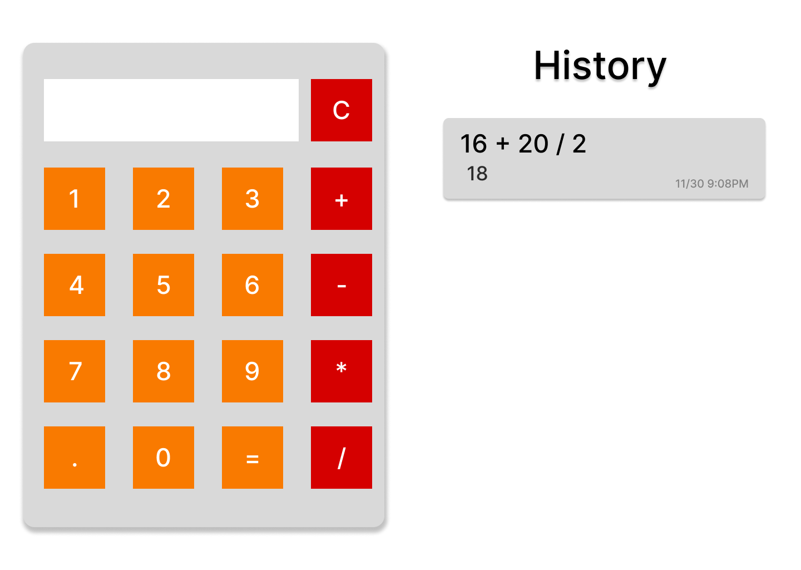

# Equalsy - Calculator
## Date: 11/30/2025
### By: Fatema Hussain
**[GitHub](https://github.com/Fatema-Abdulla) | [LinkedIn](https://www.linkedin.com/in/fatema-abdulla-bh)**
***
#### ***Description***
A simple and user-friendly calculator that performs basic and advanced calculations while keeping a temporary history of all operations during the current session. Users can see their recent calculations in a clear format, and the history resets automatically when the session ends. Features include addition, subtraction, multiplication, division.
***
#### ***Technologies Used***

* Visual Studio Code(VS Code)
    * HTML
    * CSS
    * JavaScript
***
#### ***Get Started***

The calculator has been uploaded and published; you can view the calculator [here](#).
***
#### ***WireFrame***

***
#### ***Future features***
- [ ] Add advanced operations like exponentiation and square root.
- [ ] Dark mode.

***
#### ***Credits***
[Library math.js link](https://cdnjs.com/libraries/mathjs)
[Library math.js link](https://mathjs.org/index.html)
[Join](https://developer.mozilla.org/en-US/docs/Web/JavaScript/Reference/Global_Objects/Array/join)
[Regular expressions](https://developer.mozilla.org/en-US/docs/Web/JavaScript/Guide/Regular_expressions)
[LocalStorage](https://developer.mozilla.org/en-US/docs/Web/API/Window/localStorage)
[Use JSON with localstorage](https://javascript.info/localstorage)
